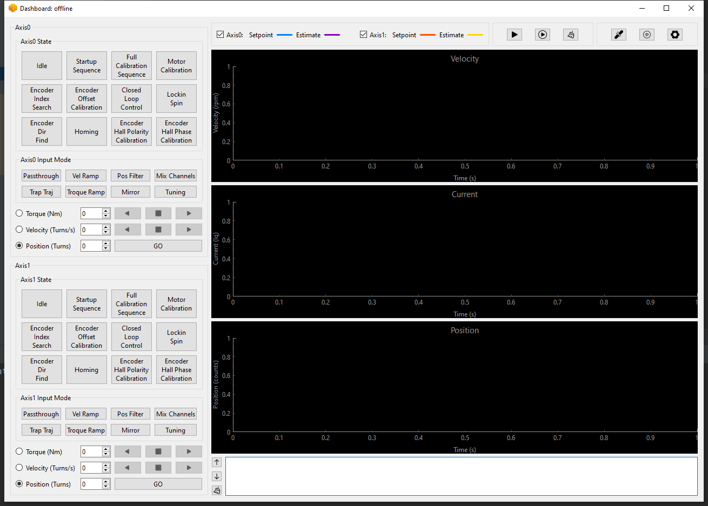

# ODriveUI

A GUI for ODrive operation.

## Usage

- Setup python environment
```
virtualenv venv
```
- Activate python virtual environment
```
source venv/bin/activate
```

- Install requirements
```
pip install -r requirements.txt
```

- Run

Power on and plug your ODrive board in, first.
```
python main.py
```

## Pack
- Pack a `release` version
```
pyinstaller -w -F main.py
```

- Pack a `debug` version
```
pyinstaller -c -F main.py
```
## TODO
- Disconnect support.
- Reconnect when the board rebooted.
- Record waves.
